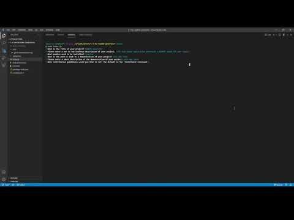

# README Generator

## License

[](https://opensource.org/licenses/MIT)

## Table of Contents

-   [Description](#Description)
-   [Installation](#Installation)
-   [Usage](#Usage)
-   [Contribution](#Contribution)
-   [Testing](#Testing)
-   [Notes](#Notes)

## Description

This node application generates a README taken from command line user input.

## Installation

```
npm i inquirer
```

## Usage
Click this for video demonstration!

<a href="https://www.youtube.com/watch?v=caL3cp2f9jc
" target="_blank"></a>
  <!-- [](https://www.youtube.com/watch?v=caL3cp2f9jc) -->

## Contribution

[Contributor Covenant](https://www.contributor-covenant.org/)

## Testing

Inquirer is the module used for this. Make sure the module is installed or else nothing will happen.

## Notes

-   If you have any questions or concerns, feel free to reach out to me at @jasonluxie on github.
-   This README was made using this application :^)
